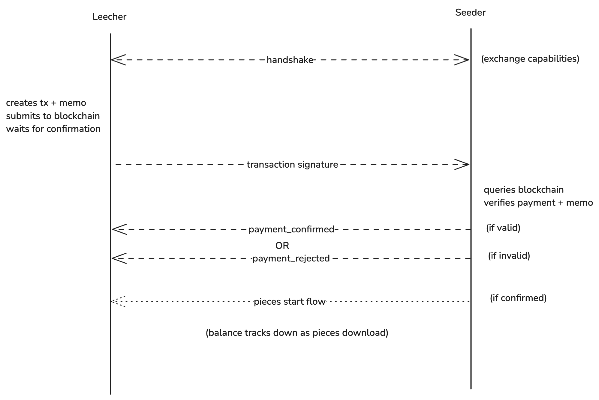

<div align="center">

# SeedPay: Payments Protocol for BitTorrent Networks

## Seeders earn crypto for sharing files. Leechers pay for faster downloads or earn credits by seeding.

</div>

> ⚠️ **Status: Pre-Alpha / Request For Comments (RFC)**
>
> This specification is **v0.2 draft** incorporating privacy protections based on community feedback.
>
> **What's New in v0.2:**
>
> 1. **Privacy Protection Implemented**: Ephemeral Session Keys (ECDH-based) replace raw PeerIDs in on-chain memos, preventing linkage between IP addresses and wallet addresses.
> 2. **Simplified Payment Model**: Payment channels with streaming micropayments for V1.
> 3. **Ratio Credits (TBD)**: System redesign in progress to prevent Sybil attacks and ensure fairness.
>
> **This is research software. Do not use in production.**
>
> See [CONTRIBUTING.md](./CONTRIBUTING.md) for how to provide feedback.

## Abstract

SeedPay is an open payment protocol that enables BitTorrent seeders to earn cryptocurrency for sharing files, while giving leechers two paths for accessing the content: pay seeders directly with stablecoins (e.g. USDC), or earn ratio credits by seeding other torrents.

By extending the BitTorrent Wire Protocol with payment handshakes and blockchain-verified proofs, SeedPay solves the free-rider problem without requiring centralized infrastructure or breaking compatibility with existing clients.

The protocol supports micropayments as low as $0.0001/MB with near-instant settlement, backward compatibility with standard BitTorrent, and optional participation. **V0.2 introduces ephemeral session keys to ensure payment privacy—blockchain observers cannot link wallet addresses to download activity.**

## 1. Motivation

### The Free-Rider Problem in BitTorrent

BitTorrent's success depends on users seeding (uploading) files after downloading them. However, rational actors have no incentive to continue seeding once their download completes—leading to the "free-rider problem."

**Consequences:**

- Popular torrents thrive (many seeders)
- Long-tail content dies (no seeders after initial interest)
- Download speeds degrade as seeder/leecher ratio drops
- Network relies on altruism, which doesn't scale

### Why Existing Solutions Are Insufficient

**Tit-for-tat (built into BitTorrent):**

- Only works during active download sessions
- No incentive to seed after completion
- Easily gamed by "hit-and-run" users

**Private trackers:**

- Enforce ratio requirements (must seed 1:1 or more)
- Require centralized coordination
- High barrier to entry (invite-only)
- Not viable for public/open content

**BitTorrent Token (BTT):**

- Centralized ledger, proprietary implementation
- Limited adoption, high friction
- Didn't integrate with existing clients

### How SeedPay Solves This

SeedPay provides **direct economic incentives** for seeding through two mechanisms:

1. **Micropayments**: Leechers pay seeders in stablecoins
   ($0.0001-$0.001/MB typical)
2. **Ratio credits**: Leechers earn credits by seeding, spend them
   to download from paid seeders

This dual model:

- Incentivizes seeding after download completion
- Works for both crypto-native and traditional users
- No centralized infrastructure required
- Backward compatible with existing clients

## 2. Protocol Overview

### 2.1 Roles

- **Leecher**: Downloads files, pays with crypto or ratio credits
- **Seeder**: Uploads files, earns crypto or ratio credits

### 2.2 Dual Participation Model

In SeedPay, Leecher has two paths for accessing the content from the paid Seeder. Either by directly paying the cryptocurrency or by using its ratio credits earned by seeding other content.

The opt-in nature of payments flow allows well-behaved actors to get access to faster download speeds through paid seeders without paying them.

### 2.3 Design Principles

- Backward compatible with BitTorrent
- Opt-in (No forced payments)
- Blockchain-agnostic (Solana first, extensible)
- Minimal trust required
- **Privacy-preserving** (v0.2): On-chain payments cannot be linked to download activity

## 3. Core Protocol Flow

The payment flow consists of four phases:



### 3.1 Handshake Phase

The handshake phase extends the existing BitTorrent peer wire handshake (BEP 3) and extension protocol (BEP 10) to advertise SeedPay support and payment terms without breaking compatibility with non-SeedPay clients.

#### 3.1.1 Standard BitTorrent Handshake

When two peers connect over TCP, they first perform the normal BitTorrent handshake as defined in BEP 3. The handshake includes:

- The protocol string `"BitTorrent protocol"`
- An 8-byte `reserved` field used for feature flags
- The torrent's `info hash`
- Each peer's 20 byte `peer_id`

SeedPay doesn't modify this message. Instead, it relies on the extension protocol flag in the `reserved field`. If both peers set the BEP 10 "extended messaging" bit in the handshake, they proceed with extended handshake.

#### 3.1.2 Extended Handshake (BEP 10)

Immediately after the standard handshake, peers that support the extension protocol exchange an extended handshake (BitTorrent message ID `20`, extended ID `0`). The payload of this message is a bencoded dictionary that:

- Advertises which extension the peer supports via `m` map (extension name → numeric ID)
- May include additional, extension-specific data

SeedPay defines a new extension named "seedpay". A Seeder that supports paid seeding MUST include an entry for "seedpay" in the m dictionary:

```json
{
  "m": {
    "seedpay": 5,
    "ut_metadata": 2
  },
  "v": "SeedPayClient 0.2",
  "seedpay": {
    "wallet": "DYw8jCN...",
    "price_per_mb": 0.0001,
    "accepts_ratio": 1,
    "min_prepayment": 0.01,
    "chain": "solana"
  }
}
```

- The numeric value `5` is the local extension ID the Seeder will use when sending and receiving SeedPay messages on this connection. The exact ID is implementation-defined and only needs to be consistent for this peer pair.
- The nested `seedpay` dictionary contains the Seeder's payment capabilities:
  - `wallet`: seeder's on-chain wallet address for receiving payments
  - `price_per_mb`: quoted price in USDC per MB
  - `accepts_ratio`: whether this peer accepts ratio credits instead of payments
  - `min_prepayment`: minimum amount required to start a paid session
  - `chain`: identifier of the settlement chain (e.g. `"solana"`)

A Leecher that supports SeedPay should also include `seedpay` in its `m` map:

```json
{
  "m": {
    "seedpay": 3
  },
  "v": "SeedPayClient 0.2"
}
```

After both extended handshakes are exchanged, each peer:

- checks whether the remote `m` contains `"seedpay"`
- records the remote extension id for `"seedpay"`
- parses the remote `seedpay` object (if present) to learn the counterparty's wallet, pricing, and ratio policy.

If either side's extended handshake does not include `"seedpay"` in `m`, the connection continues as a normal BitTorrent session without payments.

#### 3.1.3 SeedPay Capability Detection

From the Leecher's perspective, the handshake phase answers two questions:

1. Does this peer support SeedPay?

   - Yes, if `"seedpay"` is present in remote `m` map

2. What options are available?
   - If `seedpay.price_per_mb` is set → peer supports paid seeding.
   - If `seedpay.accepts_ratio` is true → peer will also accept ratio credits.

Based on this information the Leechers classifies the peer as:

- Free-only (No `seedpay` entry)
- Paid seeder (SeedPay with pricing, no ratio)
- Hybrid seeder (SeedPay with both pricing and ratio support)

Only after this handshake phase completes does the protocol move into the Payment Channel Phase, where Leechers establish ephemeral session keys and open payment channels for streaming micropayments.

### 3.2 Payment Channel Setup

Once the handshake phase is complete and the Leecher has discovered a Seeder advertising SeedPay support, the next step is to establish a cryptographically-bound payment channel. **V0.2 uses Ephemeral Session Keys to ensure privacy**—the on-chain channel opening contains no peer_id or IP address information that could link wallet activity to download behavior.

Payment channels enable streaming micropayments: the Leecher deposits funds into an escrow account, then signs off-chain payment checks as data is downloaded. The Seeder can submit the final check to claim funds, or the Leecher can close the channel after a timeout period.

#### 3.2.1 Ephemeral Key Exchange (ECDH)

Before creating the payment transaction, both peers establish a shared secret using Elliptic Curve Diffie-Hellman (ECDH) key agreement. This happens inside the existing MSE (Message Stream Encryption) tunnel, ensuring the exchange cannot be observed by network eavesdroppers.

**Process:**

1. **Leecher generates ephemeral keypair:**

   ```
   leecher_secret_key = random_32_bytes()
   leecher_public_key = leecher_secret_key × G
   ```

   Where `G` is the standard generator point on Curve25519.

2. **Seeder generates ephemeral keypair:**

   ```
   seeder_secret_key = random_32_bytes()
   seeder_public_key = seeder_secret_key × G
   ```

3. **Public key exchange (over encrypted MSE tunnel):**

   The peers exchange their ephemeral public keys via a SeedPay extension message:

   ```json
   {
     "type": "ecdh_init",
     "ephemeral_pk": "<32-byte-public-key-hex>"
   }
   ```

4. **Both parties compute shared secret:**

   ```
   Leecher: shared_secret = leecher_secret_key × seeder_public_key
   Seeder:  shared_secret = seeder_secret_key × leecher_public_key
   ```

   Due to the properties of elliptic curve mathematics, both computations yield the same `shared_secret`.

5. **Derive Session UUID using HKDF:**
   ```
   Session_UUID = HKDF-Expand(
     key: shared_secret,
     info: "seedpay-v1-session",
     length: 32 bytes
   )
   ```

The `Session_UUID` is now known only to these two peers and cryptographically binds this payment to this specific TCP connection.

**Why "seedpay-v1-session"?**

This context string provides:

- **Domain Separation**: Ensures Session_UUID is cryptographically distinct from other derived keys (e.g., if we later use the same shared_secret for encryption)
- **Version Compatibility**: Future versions can use "seedpay-v2-session" without conflicts
- **Protocol Isolation**: Prevents key reuse if another protocol also uses ECDH on the same connection

**Security Properties:**

- **Forward Secrecy**: If ephemeral keys are deleted after the session, past sessions cannot be decrypted even if long-term wallets are compromised.
- **MITM Resistance**: An attacker cannot forge the `Session_UUID` without knowing one of the private keys.
- **Unlinkability**: Blockchain observers see only `Hash(Session_UUID)` in the memo—they cannot reverse it or link it to peer activity.
- **Replay Protection**: Each session has a unique `Session_UUID`; old payment proofs cannot be reused.

#### 3.2.2 Pricing and Channel Setup

From the extended handshake, the Leecher learns the Seeder's terms:

- `wallet`: on-chain wallet address that receives the funds
- `price_per_mb`: quoted price in USDC per MB
- `min_prepayment`: minimum amount required to open a channel
- `chain`: settlement chain identifier (e.g. `"solana"`)

The Leecher may also apply local policy, such as:

- Maximum price per MB it is willing to pay
- Maximum total spend per torrent per session
- Preference for using ratio credits instead of payment when available

If the Seeder's advertised terms are acceptable, the Leecher computes an initial channel deposit amount large enough to cover some target amount of data (for example, 50–200 MB), but at least `min_prepayment`.

#### 3.2.3 Opening Payment Channel

To start a paid session, the Leecher opens a unidirectional payment channel by depositing funds into an escrow account controlled by a smart contract. The channel opening transaction MUST:

- Deposit at least `min_prepayment` (typically `price_per_mb × target_mb`) of the agreed token (e.g. USDC) into the escrow
- Include a channel identifier derived from the Session_UUID for privacy
- Include metadata binding the channel to this specific session

**Channel Opening Transaction Structure:**

The transaction creates a payment channel with the following properties:

```
channel_id = SHA-256(
  leecher_wallet_address ||
  seeder_wallet_address ||
  timestamp ||
  nonce
)

channel_state = {
  leecher: <leecher_wallet_address>
  seeder: <seeder_wallet_address>
  escrow: <escrow_account_address>
  deposited: <amount_in_tokens>
  channel_id: <channel_id>
  created_at: <blockchain_timestamp>
  timeout: <created_at + timeout_period>
  last_nonce: 0
  status: "Open"
}
```

**Channel ID Derivation:**

The `channel_id` MUST be deterministically derivable from on-chain data (wallet addresses, timestamp, nonce) so that the smart contract can create and lookup channels without requiring the Session_UUID. The session binding for privacy is handled separately via the memo's `session_hash` field (see Section 3.3.2).

**Memo Format (Privacy-Preserving):**

The channel opening transaction includes a memo containing only the opaque session identifier:

```json
{
  "protocol": "seedpay",
  "version": "1.0",
  "session_hash": "a3f5c8d9e2b1...",
  "nonce": 1702700000000
}
```

Where:

- `session_hash` = hex(SHA-256(Session_UUID)) — an opaque 32-byte hash
- `nonce` = timestamp (Unix milliseconds) for freshness and replay prevention

**Privacy Properties:**

- No `peer_id` on chain (cannot link to swarm activity)
- No IP address information
- `session_hash` is computationally irreversible (256-bit preimage resistance)
- Each session has a unique hash (unlinkable across sessions)
- Blockchain observers cannot determine what torrent is being downloaded

The Leecher signs and submits the channel opening transaction to the blockchain. Once the network accepts the transaction and returns the transaction signature, the Leecher SHOULD wait until the transaction reaches at least **confirmed** status before proceeding.

#### 3.2.4 Channel Opening Notification

After the channel opening transaction is confirmed on-chain, the Leecher sends a channel opening notification to the Seeder over the SeedPay extension channel. This message contains the transaction signature—the Seeder will independently verify the channel on-chain.

```json
{
  "type": "channel_opened",
  "tx_signature": "<transaction_signature>",
  "channel_id": "<channel_identifier>",
  "amount": 0.01,
  "timestamp": 1702700000000
}
```

- `tx_signature`: the blockchain transaction signature of the channel opening
- `channel_id`: the channel identifier (for reference, not trusted)
- `amount`: the deposited amount (for UI/logging purposes only, not trusted by Seeder)
- `timestamp`: when the notification was created (for freshness checks)

**Important:** The Seeder MUST NOT rely on the `amount` field or any other client-provided data. All validation is done against the on-chain channel state.

A Seeder that receives a `channel_opened` message MUST NOT start sending pieces yet. Instead, it proceeds to the Verification Phase (Section 3.3) to verify the channel on-chain.

#### 3.2.5 Streaming Off-Chain Payments

Once the payment channel is verified and open, the Leecher can stream micropayments by signing off-chain payment checks. As data is downloaded, the Leecher signs payment checks that authorize the Seeder to claim increasing amounts from the escrow.

**Payment Check Structure:**

Each payment check is a signed message containing:

```json
{
  "channel_id": "<channel_identifier>",
  "amount": 0.005,
  "nonce": 1,
  "signature": "<ed25519_signature>"
}
```

Where:

- `channel_id`: identifies which payment channel this check belongs to
- `amount`: cumulative amount authorized (in token units, e.g. USDC)
- `nonce`: monotonically increasing sequence number (prevents replay)
- `signature`: Ed25519 signature over `channel_id || amount || nonce` using the Leecher's wallet key

**Payment Check Signing:**

The payment check MUST use structured encoding to prevent ambiguity and collision attacks:

```
// Option 1: Structured binary encoding (recommended)
payment_check_data = {
  channel_id: [u8; 32],
  amount: u64,
  nonce: u64
}
message = serialize(payment_check_data)  // e.g., Borsh, CBOR, or Protocol Buffers
message_hash = SHA-256(message)
signature = ed25519_sign(leecher_private_key, message_hash)

// Option 2: Delimited string encoding (alternative)
message = channel_id + ":" + amount.to_string() + ":" + nonce.to_string()
message_hash = SHA-256(message)
signature = ed25519_sign(leecher_private_key, message_hash)
```

**Important:** The signature MUST be computed over a hash of the message, not the raw message, to ensure consistent signature length and prevent length extension attacks.

**Sending Payment Checks:**

The Leecher sends payment checks periodically or when the Seeder requests an update. Payment checks are sent over the SeedPay extension channel:

**Recommended Payment Check Frequency:**

- Small downloads (<100MB): Every 10MB or every 40 pieces
- Medium downloads (100MB-1GB): Every 50MB or every 200 pieces
- Large downloads (>1GB): Every 100MB or every 400 pieces

The Leecher SHOULD send checks proactively rather than waiting for `payment_check_required` messages to minimize download interruptions.

**Payment Check Message Format:**

```json
{
  "type": "payment_check",
  "channel_id": "<channel_identifier>",
  "amount": 0.005,
  "nonce": 1,
  "signature": "<base64_encoded_signature>"
}
```

**Payment Check Validation:**

The Seeder validates each payment check:

1. Verify the signature using the Leecher's public key (from channel state)
2. Verify `nonce` is greater than the last accepted nonce for this channel
3. Verify `amount` does not exceed the channel deposit
4. Verify `amount` is greater than or equal to the last accepted amount

If validation passes, the Seeder updates its local channel state and continues serving pieces. The Seeder stores the highest valid payment check for later submission when closing the channel.

**Security Properties:**

- Each check is cryptographically signed (cannot be forged)
- Nonce prevents replay of old checks
- Amount must be monotonically increasing
- Seeder can only claim up to the highest valid check amount

#### 3.2.6 Closing Payment Channel

The payment channel can be closed in two ways: cooperative close (Seeder submits final check) or timeout close (Leecher force-closes after timeout).

**Cooperative Close (Normal Case):**

When the download completes or the session ends, the Seeder submits the highest valid payment check to the blockchain to claim funds:

```
close_channel(
  channel_id: <channel_id>
  amount: <highest_check_amount>
  nonce: <highest_check_nonce>
  signature: <highest_check_signature>
)
```

The smart contract:

1. Verifies the payment check signature
2. Verifies the nonce is valid and higher than any previously closed amount
3. Transfers `amount` from escrow to Seeder's wallet
4. Refunds remaining balance (`deposited - amount`) to Leecher's wallet
5. Closes the channel (marks as settled)

**Timeout Close (Leecher Force-Close):**

If the Seeder disappears or fails to close the channel, the Leecher can force-close after the timeout period:

```
timeout_close(
  channel_id: <channel_id>
)
```

The smart contract:

1. Verifies the current time exceeds `channel.timeout`
2. Refunds the entire deposit to Leecher's wallet
3. Closes the channel

**Timeout Period:**

**Default Timeout Period:** 86400 seconds (24 hours)

The timeout period MUST be included in the channel opening transaction and stored in the channel state. Both parties MUST agree on the timeout before channel creation.

**Recommended timeout values:**

- Quick downloads (< 1 hour expected): 3600 seconds (1 hour)
- Standard downloads: 86400 seconds (24 hours)
- Long-running channels: 604800 seconds (7 days)

The timeout MUST be at least 3600 seconds (1 hour) to allow for normal session completion. The Leecher can force-close the channel after the timeout period expires, receiving a full refund of any unspent deposit.

**Channel Closing Notification:**

After a channel is closed (either cooperatively or via timeout), the closing party SHOULD notify the other peer:

```json
{
  "type": "channel_closed",
  "channel_id": "<channel_identifier>",
  "tx_signature": "<closing_transaction_signature>",
  "final_amount": 0.005,
  "reason": "cooperative" | "timeout"
}
```

This allows both parties to update their local state and clean up session information.

### 3.3 Verification Phase

In the verification phase, the Seeder independently checks the on-chain payment channel before opening a paid session. The Seeder treats the blockchain as the source of truth and MUST NOT rely solely on the `channel_opened` message contents.

#### 3.3.1 On-Chain Channel Lookup

Upon receiving a `channel_opened` message, the Seeder performs a read-only lookup on the configured chain using the provided `tx_signature`. The Seeder MUST:

1. Fetch the transaction by `tx_signature` from a trusted RPC endpoint.
2. Reject if the transaction cannot be found or has not yet reached at least **confirmed** status.
3. Parse the transaction to locate:
   - The channel creation instruction
   - The escrow account that holds the deposited funds
   - The deposited amount
   - The channel state (leecher, seeder, timeout, etc.)
   - Any memo instruction attached to the transaction

If any of these steps fail (e.g. malformed transaction, missing channel creation, missing memo), the Seeder MUST treat the channel as invalid.

#### 3.3.2 Channel Validation Rules

**Expected Channel State Structure (On-Chain):**

The smart contract MUST maintain channel state with the following structure:

```
channel_state = {
  leecher: <wallet_address>,        // Leecher's wallet address
  seeder: <wallet_address>,          // Seeder's wallet address
  escrow: <escrow_account_address>,  // Token account holding deposited funds
  deposited: <u64>,                  // Amount deposited (in token units)
  channel_id: <[u8; 32]>,            // Unique channel identifier
  created_at: <i64>,                 // Unix timestamp of channel creation
  timeout: <i64>,                    // created_at + timeout_period
  last_nonce: <u64>,                 // Highest nonce from closed checks (0 if not closed)
  status: <ChannelStatus>            // Open | Closed | Timedout
}

ChannelStatus = "Open" | "Closed" | "Timedout"
```

A payment channel is considered **valid** only if all of the following checks pass:

1. **Channel state check**

   - The channel MUST exist on-chain and be in an "Open" state.
   - The Seeder's wallet address in the channel state MUST equal the Seeder's configured `wallet` from the handshake.

2. **Deposit amount check**

   - The deposited amount MUST be greater than or equal to the Seeder's `min_prepayment`.
   - The Seeder MAY also enforce a maximum amount for its own policy.

3. **Token check**

   - The escrow MUST hold the expected token (e.g. USDC) and on the expected chain.

4. **Memo binding check (Privacy-Preserving)**

   - The channel opening transaction MUST contain a memo whose decoded JSON matches the SeedPay memo format:
     ```json
     {
       "protocol": "seedpay",
       "version": "1.0",
       "session_hash": "<hex-string>",
       "nonce": 1702700000000
     }
     ```
   - `protocol` MUST equal `"seedpay"` and `version` MUST match a version the Seeder supports.
   - **Session Binding**: The Seeder computes `expected_hash = SHA-256(Session_UUID)` using the Session_UUID derived during ECDH key exchange (Section 3.2.1).
   - The `session_hash` field in the memo MUST equal `expected_hash`.
   - This proves the channel is bound to THIS specific connection without revealing peer_id or IP information.

5. **Freshness / replay protection**

   - The Seeder MUST ensure the channel opening is recent: `nonce` or the transaction's block time MUST be within an acceptable window (e.g. 5–10 minutes) to prevent reuse of old channels.
   - The Seeder MUST maintain a set of already-used channel identifiers and reject any channel that has already been used for a session.

6. **Error-free execution**
   - The transaction's metadata MUST indicate success; any failed or reverted transaction MUST be treated as invalid.

If any validation step fails, the Seeder MUST reject the channel.

#### 3.3.3 Seeder Response

After running the validation checks, the Seeder responds over the SeedPay extension channel.

**On success**, the Seeder:

1. Creates a **payment session** associated with this connection, initializing:

   - `channel_id` = verified channel identifier
   - `channel_deposit` = verified deposited amount
   - `last_check_nonce` = 0
   - `last_check_amount` = 0
   - `bytes_downloaded` = 0
   - `price_per_mb` = value from the handshake
   - `channel_timeout` = timeout from channel state

2. Sends a `channel_confirmed` message to the Leecher:

   ```json
   {
     "type": "channel_confirmed",
     "confirmed": true,
     "channel_id": "<channel_identifier>",
     "deposit": 0.01,
     "price_per_mb": 0.0001,
     "timeout": 1702703600000
   }
   ```

3. **Unchokes** the Leecher on the BitTorrent wire, allowing piece requests to proceed.

**On failure**, the Seeder:

1. Sends a `channel_rejected` message:

   ```json
   {
     "type": "channel_rejected",
     "confirmed": false,
     "reason": "tx_not_found" | "tx_failed" | "wrong_seeder" |
               "insufficient_deposit" | "session_mismatch" | "replayed_channel" |
               "expired" | "invalid_channel_state"
   }
   ```

   Note: `"session_mismatch"` replaces `"memo_mismatch"` from v0.1 to reflect the new ECDH-based binding.

2. Keeps the Leecher **choked**, so no paid pieces are sent for this session.
3. MAY allow the Leecher to retry with a new channel opening, or MAY close the connection according to local policy.

Once a channel has been confirmed and a payment session created, the protocol transitions to the **Data Transfer Phase** (Section 3.4).

### 3.4 Data Transfer

After a payment session is established, the Seeder begins serving pieces to the Leecher while tracking payment checks. This phase reuses the normal BitTorrent request/response messages and adds only local accounting and payment check validation.

#### 3.4.1 Mapping Pieces to Cost

SeedPay doesn't modify the BitTorrent wire messages used for data transfer (`request`, `piece`, `cancel`). Instead the Seeder:

- observes each `request` message from the Leecher
- computes the byte length of the requested block
- converts that length into monetary cost using the agreed `price_per_mb` from the handshake:

$$
\text{cost} = \frac{\text{bytes}}{1024 \times 1024} \times \text{price\_per\_mb}
$$

The Seeder maintains, per payment session:

- `channel_id` (payment channel identifier)
- `channel_deposit` (total amount locked in escrow)
- `last_check_nonce` (highest nonce from valid payment checks)
- `last_check_amount` (highest amount authorized by valid payment checks)
- `bytes_downloaded` (cumulative bytes served under this session)
- `price_per_mb` (agreed rate)

A Seeder MAY track usage either on `request` or on successful `piece` send. For accuracy, tracking on successful `piece` send is RECOMMENDED.

#### 3.4.2 Serving Requests Under Payment Check Constraints

For each upcoming `request(index, begin, length)` from the Leecher, the Seeder performs:

1. Look up the associated payment session for this connection.

   - If no active session exists, the Seeder MUST keep the peer choked and MUST NOT serve paid pieces.

2. Compute the monetary cost of serving this block as described above.

3. Compute the cumulative cost: `cumulative_cost = (bytes_downloaded + length) / (1024 * 1024) * price_per_mb`

4. Check whether `last_check_amount >= cumulative_cost`

If `last_check_amount` is sufficient:

- The Seeder increments `bytes_downloaded` by `length`.
- Sends the corresponding `piece` message as in standard BitTorrent.

If `last_check_amount` is not sufficient:

- The Seeder MAY send a `payment_check_required` control message over the SeedPay extension:

  ```json
  {
    "type": "payment_check_required",
    "required_amount": 0.005,
    "current_check_amount": 0.003,
    "estimated_remaining_mb": 20.0
  }
  ```

- **Handling In-Flight Payment Checks:** Before choking due to insufficient payment, the Seeder SHOULD wait a short grace period (e.g., 5 seconds) to allow any in-flight payment checks to arrive. This prevents unnecessary choke/unchoke cycles when the Leecher is already sending payment checks proactively.

- After the grace period, if no valid payment check has been received, the Seeder SHOULD choke the Leecher (normal BitTorrent `choke` state) to prevent further paid downloads until a new payment check is received.

The Leecher, upon receiving `payment_check_required` or observing stalled progress, SHOULD send a new payment check with an increased amount covering the cumulative cost of data served so far.

#### 3.4.3 Payment Check Processing

When the Seeder receives a `payment_check` message during data transfer:

1. Validate the payment check signature using the Leecher's public key from the channel state.

2. Verify the nonce is greater than `last_check_nonce` (prevents replay).

3. Verify the amount is greater than or equal to `last_check_amount` (must be monotonically increasing).

4. Verify the amount does not exceed `channel_deposit` (cannot authorize more than deposited).

If all validations pass:

- Update `last_check_nonce` = check nonce
- Update `last_check_amount` = check amount
- If the Seeder was choked due to insufficient payment, unchoke the Leecher
- Continue serving pieces

If validation fails:

- Reject the payment check
- Keep the Leecher choked
- MAY send an error message indicating the reason for rejection

#### 3.4.4 Session Lifetime and Channel Closure

Payment sessions are not intended to last indefinitely. A Seeder SHOULD treat a session as expired if any of the following conditions hold:

- The channel timeout has been reached (allowing Leecher to force-close).
- The connection is closed or idle for longer than an implementation-defined timeout.
- The ephemeral keys have been deleted (session cannot be verified for new channels).

When a session ends (either normally or due to expiry), the Seeder SHOULD:

1. Submit the highest valid payment check to close the channel cooperatively (Section 3.2.6).
2. If cooperative close is not possible (e.g., connection lost), the Leecher can force-close after timeout.
3. Discard the session state (channel tracking, usage counters).
4. Delete the ephemeral secret key (ensures forward secrecy).

The Seeder MAY continue to serve as a free seeder (if its local policy allows) or close the connection.

#### 3.4.5 Interaction with Ratio Credits

If the Seeder's handshake advertised `accepts_ratio = true`, the client MAY combine payment checks with a separate ratio credit check instead of strict "payment check or nothing" behavior:

- If the payment channel deposit is exhausted but the Leecher presents valid ratio credits, the Seeder may continue serving pieces and decrement ratio credits instead of requiring new payment checks.

This design allows the same Data Transfer Phase to handle pure paid sessions, pure ratio-based sessions, or hybrid sessions without modifying the underlying BitTorrent wire protocol.

## 4. Ratio Credits System

### 4.1 Overview

_[Draft/TBD - This section will detail the ratio credits mechanism]_

Ratio credits allow leechers to earn access to paid seeders by seeding other torrents, creating a circular economy within the SeedPay network.

**Design Challenges Being Addressed:**

- Preventing Sybil attacks (users farming credits with fake seeders)
- Ensuring credits have real value (tied to actual bandwidth provision)
- Cross-torrent credit portability

### 4.2 Credit Earning

_[Draft/TBD - How leechers earn credits by seeding]_

### 4.3 Credit Spending

_[Draft/TBD - How credits are spent and verified]_

### 4.4 Credit Transfer and Verification

_[Draft/TBD - On-chain or off-chain credit ledger, verification mechanisms]_

## 5. Security Considerations

### 5.1 Privacy Model

**V0.2 Privacy Guarantees:**

The ephemeral session key design provides the following privacy properties:

1. **Unlinkability (Blockchain → Swarm)**

   - Blockchain observers see: `wallet_A → wallet_B, memo: {session_hash: "0xabc..."}`
   - They CANNOT determine: which torrent, which peer_id, which IP address
   - Preimage resistance of SHA-256 prevents reversing the session_hash

2. **Unlinkability (Session → Session)**

   - Each TCP connection uses fresh ephemeral keys
   - Different sessions produce different Session_UUIDs
   - Blockchain observers cannot link multiple payments from the same user

3. **Forward Secrecy**
   - Ephemeral keys deleted after session ends
   - Compromising a wallet AFTER the fact cannot decrypt past sessions
   - Past download history remains private

**What is NOT Private:**

- The fact that wallet_A paid wallet_B (amounts and timing are public)
- Seeder wallet addresses (visible in handshake and on-chain)
- Connection metadata visible to ISP/network observer (use VPN/Tor for full privacy)

**Privacy Best Practices for Users:**

- Use Tor or VPN for IP address privacy
- Use burner wallets funded via mixers for maximum anonymity
- Avoid reusing the same Seeder/Leecher combination if privacy is critical

### 5.2 Payment Verification

**Security Properties:**

- Seeders MUST verify payments on-chain (blockchain is source of truth)
- ECDH binding prevents payment proof replay across different connections
- Nonce freshness prevents replay of old payments
- Transaction signature tracking prevents double-spending

**Attack Mitigations:**

- **Fake Payment Proof**: Seeder fetches transaction independently, ignores Leecher-provided `amount`
- **Replay Attack**: Seeder checks nonce freshness and maintains consumed tx_signature set
- **MITM Attack**: ECDH ensures only peers with correct ephemeral keys can derive Session_UUID

### 5.3 Peer Authentication

_[Draft/TBD - How to prevent peer_id spoofing, Sybil attacks in ratio credit system]_

### 5.4 Economic Attacks and Mitigations

#### 5.4.1 Maximum Loss Per Session

The payment channel design limits the maximum loss for both parties:

**For Leecher:**

- Maximum loss: Amount deposited in channel (e.g., 0.01 USDC)
- Occurs if: Seeder sends no data after channel opening
- Mitigation: Leecher can force-close after timeout to recover funds

**For Seeder:**

- Maximum loss: $0 (Seeder only serves data after verifying channel on-chain)
- Occurs if: Leecher stops sending payment checks mid-download
- Mitigation: Seeder stops serving data when payment checks stop

#### 5.4.2 Griefing Attacks

**Attack: Leecher Opens Channel But Never Downloads**

Scenario:

1. Leecher opens payment channel (locks 0.01 USDC)
2. Leecher never requests any pieces
3. Seeder's capital is not at risk, but channel occupies contract state

Mitigation:

- Channels can be force-closed by Leecher after timeout
- Seeder can set `min_prepayment` high enough to deter spam
- Smart contract can charge a small creation fee to prevent spam

**Attack: Leecher Requests Data But Sends No Payment Checks**

Scenario:

1. Leecher opens valid channel
2. Leecher requests pieces but never sends payment checks
3. Seeder serves 1-2 pieces before realizing no payment is coming

Mitigation:

- Seeder requires first payment check before sending ANY data
- Or, Seeder sends 1 piece, then waits for payment check before continuing
- Maximum loss: Cost of 1 piece (~$0.000025)

**Attack: Seeder Sends Corrupted Data**

Scenario:

1. Seeder sends corrupted piece
2. Leecher detects corruption via BitTorrent hash verification
3. Leecher stops sending payment checks

Result:

- Seeder earned: Payment for pieces sent before corruption
- Leecher lost: Payment for corrupted piece only
- Maximum loss: Cost of 1 corrupted piece (~$0.000025)

Mitigation:

- Built into protocol: Leecher verifies piece hashes before signing checks
- Leecher can disconnect and use remaining channel balance with another seeder

#### 5.4.3 Sybil Attacks on Payment Channels

**Attack: Malicious Seeder Creates Many Identities**

Scenario:

1. Attacker creates 100 Seeder wallets
2. Advertises content but sends garbage data
3. Each Seeder scams 1 Leecher per day

Analysis:

- Cost to Leecher per scam: 1 piece = $0.000025
- Attacker gain: $0.000025 per scam = $0.0025/day for 100 seeders
- Not economically rational

**Attack: Leecher Opens Many Channels, Never Closes**

Scenario:

1. Leecher opens 1000 channels with different Seeders
2. Deposits $0.01 each = $10 total locked
3. Leecher disappears, never closes channels

Impact:

- Leecher loses: $10 (funds locked until timeout)
- Seeders lose: $0 (no cost to Seeders)
- Blockchain state: 1000 open channels (contract storage cost)

Mitigation:

- Channels auto-close after timeout (Leecher can force-close)
- Smart contract can implement storage rent (chain-specific feature)
- Max timeout of 7 days limits lock duration

#### 5.4.4 Front-Running Attacks

**Attack: Seeder Front-Runs Channel Close**

Scenario:

1. Leecher broadcasts timeout_close() transaction
2. Seeder sees it in mempool
3. Seeder front-runs with close_channel() using an old, low payment check

Analysis:

- Seeder cannot front-run with lower amount than Leecher already signed
- Contract enforces monotonically increasing amounts
- Even if Seeder front-runs, they can only claim what Leecher authorized

Result: Attack ineffective, protocol is front-run resistant

#### 5.4.5 Replay Attacks

**Attack: Seeder Reuses Old Payment Check**

Scenario:

1. Leecher signs check #5 (amount: 0.005)
2. Later, Leecher signs check #10 (amount: 0.01)
3. Seeder tries to close with check #5 (to keep more funds)

Mitigation:

- Smart contract tracks `last_nonce`
- Only accepts checks with nonce > last_nonce
- Cannot replay old checks

**Attack: Seeder Reuses Payment Check Across Sessions**

Scenario:

1. Session A: Leecher signs check for channel A
2. Session B: Seeder tries to use same check for channel B

Mitigation:

- Payment check includes channel_id in signed message
- Check is only valid for specific channel
- Cannot replay across channels

## 6. Implementation Notes

### 6.1 Cryptographic Requirements

**Elliptic Curve:** Curve25519 (x25519)

- Well-established, audited implementations available
- Fast key generation and ECDH computation
- Widely supported (libsodium, NaCl, OpenSSL)

**Key Derivation:** HKDF-SHA256

- Context string: `"seedpay-v1-session"`
- Output length: 32 bytes

**Hashing:** SHA-256

- For computing `session_hash` from Session_UUID

**Random Number Generation:**

- MUST use cryptographically secure RNG (e.g., `/dev/urandom`, `crypto.getRandomValues()`)
- Ephemeral secret keys MUST be truly random (no deterministic derivation)

### 6.2 Blockchain Integration

#### 6.2.1 Smart Contract Requirements

The payment channel MUST be implemented as a smart contract (or program) on the target blockchain. The contract MUST provide the following functions:

**Required Functions:**

1. **open_channel**: Creates a new payment channel

   - Parameters: `leecher`, `seeder`, `deposit_amount`, `timeout_period`, `channel_id`, `memo`
   - Actions:
     - Transfers tokens from Leecher to escrow account
     - Creates channel state record
     - Stores channel metadata
   - Returns: Transaction signature

2. **close_channel**: Closes channel with final payment check (cooperative close)

   - Parameters: `channel_id`, `amount`, `nonce`, `signature`
   - Actions:
     - Verifies payment check signature
     - Verifies nonce > last_nonce
     - Transfers `amount` to Seeder
     - Refunds `deposited - amount` to Leecher
     - Marks channel as closed
   - Returns: Transaction signature

3. **timeout_close**: Closes channel after timeout (force-close by Leecher)
   - Parameters: `channel_id`
   - Actions:
     - Verifies current time > channel.timeout
     - Refunds entire deposit to Leecher
     - Marks channel as timed out
   - Returns: Transaction signature

**Account/State Structure:**

The smart contract MUST maintain channel state with the structure defined in Section 3.3.2. The contract MUST use deterministic account addressing (e.g., Program Derived Addresses on Solana, CREATE2 on Ethereum) to ensure channel accounts can be computed from channel parameters.

**Transaction Construction:**

For opening a channel:

```
transaction = {
  instructions: [
    token_transfer(leecher -> escrow, amount),
    create_channel_state(
      leecher: leecher_wallet,
      seeder: seeder_wallet,
      escrow: escrow_account,
      deposited: amount,
      channel_id: channel_id,
      created_at: current_timestamp,
      timeout: current_timestamp + timeout_period,
      last_nonce: 0,
      status: "Open"
    ),
    attach_memo({
      protocol: "seedpay",
      version: "1.0",
      session_hash: session_hash,
      nonce: nonce
    })
  ],
  signers: [leecher_private_key]
}
```

#### 6.2.2 Token Program Requirements

The blockchain MUST support:

- Token transfers (fungible tokens, e.g., USDC)
- Escrow accounts controlled by smart contracts
- Memo/note attachment to transactions

**Token Standards:**

- Solana: SPL Token program
- Ethereum/EVM: ERC-20 tokens
- Other chains: Equivalent fungible token standard

#### 6.2.3 RPC Provider Requirements

For production Seeders, use dedicated RPC providers with sufficient rate limits:

**Minimum Requirements:**

- Read operations: At least 10 requests/second
- Write operations: At least 5 transactions/second
- Confirmation time: < 5 seconds for "confirmed" status

**Recommended Providers:**

- Use dedicated RPC providers (not public free-tier)
- Implement retry logic with exponential backoff
- Cache channel state to reduce RPC calls

**RPC Operations Required:**

1. **Channel Opening Verification:**

   - Fetch transaction by signature
   - Parse channel creation instruction
   - Verify channel state on-chain
   - Cost: 1 RPC call per channel

2. **Channel Closing:**

   - Submit close_channel or timeout_close transaction
   - Wait for confirmation
   - Cost: 1 RPC call per close

3. **Payment Check Validation:**
   - Validated off-chain (no RPC calls needed)
   - Only requires on-chain verification when closing channel

#### 6.2.4 Confirmation Requirements

**Channel Opening:**

- MUST wait for at least "confirmed" status before proceeding
- RECOMMENDED to wait for "finalized" status for production use

**Channel Closing:**

- MUST wait for at least "confirmed" status
- RECOMMENDED to wait for "finalized" status before considering funds received

**Confirmation Levels:**

- "Confirmed": Transaction included in block, may be reverted
- "Finalized": Transaction cannot be reverted (chain-specific, e.g., Solana finality, Ethereum finality)

### 6.3 Client Compatibility

_[Draft/TBD - How to implement SeedPay as a BitTorrent client extension, backward compatibility testing]_

**MSE (Message Stream Encryption) Requirement:**

- SeedPay V0.2 REQUIRES MSE for ECDH key exchange
- Clients MUST implement BEP 52 (MSE) to support SeedPay payments
- Fallback to unencrypted mode is NOT supported for payment sessions

### 6.4 Performance Considerations

**ECDH Overhead:**

- Key generation: ~0.1ms on modern hardware
- Key exchange: 2 round-trips (within existing handshake flow)
- HKDF derivation: <0.01ms

**RPC Rate Limits:**

- Solana public RPCs: ~10 req/sec
- Recommended: use dedicated RPC provider for production Seeders
- Channel opening verification requires 1 RPC call per channel
- Channel closing requires 1 RPC call (cooperative close) or 1 RPC call + wait for timeout (force close)
- Payment checks are validated off-chain (no RPC calls needed during data transfer)

### 6.5 Error Handling

#### 6.5.1 Connection Drops Mid-Session

**Scenario:** TCP connection is lost during data transfer.

**Leecher Behavior:**

- If connection drops before sending final payment check:
  - Leecher can reconnect and continue with same channel (if channel still open)
  - Or, Leecher can force-close channel after timeout to recover unspent deposit
- If connection drops after sending payment check:
  - Seeder may have already received check and can close channel
  - Leecher should monitor channel state to verify final settlement

**Seeder Behavior:**

- If connection drops before receiving final payment check:
  - Seeder should attempt to close channel with highest received check
  - If no valid check received, Seeder cannot claim funds (Leecher will timeout close)
- If connection drops after receiving payment check:
  - Seeder should close channel immediately with received check
  - Seeder should not wait for reconnection

#### 6.5.2 RPC Failures During Channel Verification

**Scenario:** RPC endpoint is unavailable or returns error when verifying channel.

**Retry Strategy:**

- Implement exponential backoff: 1s, 2s, 4s, 8s, 16s
- Maximum retries: 5 attempts
- After max retries: Reject channel and keep Leecher choked

**Fallback:**

- Seeder can maintain list of trusted RPC providers
- Switch to backup RPC provider if primary fails
- Cache recent channel verifications to reduce RPC dependency

#### 6.5.3 Invalid Payment Check Handling

**Scenario:** Seeder receives payment check with invalid signature or stale nonce.

**Validation Failures:**

- Invalid signature: Reject check, send error message, keep Leecher choked
- Stale nonce: Reject check, send error with expected nonce, keep Leecher choked
- Amount exceeds deposit: Reject check, send error, keep Leecher choked
- Amount not monotonically increasing: Reject check, send error, keep Leecher choked

**Error Message Format:**

```json
{
  "type": "payment_check_rejected",
  "channel_id": "<channel_identifier>",
  "reason": "invalid_signature" | "stale_nonce" | "amount_exceeds_deposit" | "amount_not_increasing",
  "expected_nonce": 5,
  "received_nonce": 3
}
```

#### 6.5.4 Channel Timeout Edge Cases

**Scenario:** Channel timeout approaches while download is still in progress.

**Leecher Behavior:**

- Monitor channel timeout (e.g., check every 10 minutes)
- If timeout approaching (< 1 hour remaining) and download incomplete:
  - Option 1: Open new channel and continue download
  - Option 2: Extend timeout (if supported by contract)
  - Option 3: Force-close and recover funds

**Seeder Behavior:**

- Monitor channel timeout for active sessions
- If timeout approaching and download incomplete:
  - Send warning message to Leecher
  - Request new channel or timeout extension
  - If no response, prepare to close channel with highest check

**Timeout Warning Message:**

```json
{
  "type": "channel_timeout_warning",
  "channel_id": "<channel_identifier>",
  "timeout_in_seconds": 3600,
  "recommended_action": "open_new_channel" | "extend_timeout"
}
```

#### 6.5.5 Transaction Failures

**Scenario:** Channel opening or closing transaction fails on-chain.

**Channel Opening Failure:**

- Leecher should retry with new nonce (to avoid replay)
- If repeated failures: Check network conditions, increase gas/fee if applicable
- Maximum retries: 3 attempts before giving up

**Channel Closing Failure:**

- Seeder (cooperative close): Retry with same payment check
- Leecher (timeout close): Retry with same channel_id
- If repeated failures: May indicate network congestion, wait and retry later

#### 6.5.6 Recovery Procedures

**Leecher Recovery:**

1. On startup, scan for open channels associated with wallet
2. For each open channel:
   - Check if timeout has passed
   - If timed out: Force-close to recover funds
   - If not timed out: Check if download can continue or should be abandoned

**Seeder Recovery:**

1. On startup, scan for open channels where this wallet is the seeder
2. For each open channel:
   - Check if valid payment checks were received
   - If valid checks exist: Close channel to claim funds
   - If no valid checks: Channel will timeout, no action needed

## 7. Future Extensions

### 7.1 Multi-Chain Support

_[Draft/TBD - Extending to other blockchains beyond Solana]_

The ECDH-based session binding is chain-agnostic and can be implemented on:

- Ethereum (use EIP-3009 for meta-transactions)
- Base, Arbitrum, Optimism (L2s with low fees)
- Other EVM-compatible chains

### 7.2 Advanced Payment Models

**Payment Channels (V1):**

- Currently implemented in V0.2
- Enables streaming micropayments with off-chain payment checks
- Reduces on-chain footprint to 2 transactions per session (open/close)
- Uses ECDH session binding for privacy

**Why Unidirectional Channels for V1:**

SeedPay V1 uses unidirectional channels (Leecher → Seeder only) because:

- Seeders earn, Leechers pay (one direction of value flow)
- Simpler state management (no need for both parties to sign updates)
- Lower risk (only Leecher's deposit is at risk)
- Sufficient for core use case of paid file downloads

Bidirectional channels would be useful for:

- Ratio credit transfers (Seeder → Leecher)
- Refunds or disputes
- Will be considered for V2 if ratio credit system requires it

**Future Payment Models:**

**Bidirectional Payment Channels:**

- Allow both parties to send payments (for ratio credit transfers)
- More complex state management, requires both parties to sign updates

**Probabilistic Payments:**

- Lottery-style micropayments for extreme scalability
- Trade certainty for reduced transaction count
- Useful for very high-frequency, low-value transactions

**Multi-Hop Payment Routing:**

- Allow payments through intermediate nodes
- Enables payment channel networks (similar to Lightning Network)
- Requires routing protocol and liquidity management

### 7.3 Reputation Systems

_[Draft/TBD - Seeder reputation, leecher trust scores]_

## 8. References

### 8.1 BitTorrent Protocol Specifications

- BEP 3: [The BitTorrent Protocol Specification](https://www.bittorrent.org/beps/bep_0003.html)
- BEP 10: [Extension Protocol](https://www.bittorrent.org/beps/bep_0010.html)
- BEP 52: [Message Stream Encryption](https://www.bittorrent.org/beps/bep_0052.html)

### 8.2 Cryptographic Standards

- RFC 7748: [Elliptic Curves for Security (Curve25519)](https://tools.ietf.org/html/rfc7748)
- RFC 5869: [HKDF (HMAC-based Key Derivation Function)](https://tools.ietf.org/html/rfc5869)
- NIST FIPS 180-4: [Secure Hash Standard (SHA-256)](https://nvlpubs.nist.gov/nistpubs/FIPS/NIST.FIPS.180-4.pdf)

### 8.3 Related Work

- [Coinbase x402 Protocol](https://github.com/coinbase/x402) - HTTP-native micropayments
- [Lightning Network](https://lightning.network/) - Bitcoin payment channels
- [BitTorrent Token (BTT)](https://www.bittorrent.com/token/btt/) - Previous attempt at paid BitTorrent

---

**Changelog:**

- **v0.2 (2024-12-21)**: Introduced ECDH-based ephemeral session keys for privacy, removed peer_id from on-chain memos, implemented unidirectional payment channels with off-chain payment checks for streaming micropayments
- **v0.1 (2024-12-15)**: Initial draft with peer_id-based memo binding (deprecated due to privacy concerns)

---

**Note**: Sections marked as "Draft/TBD" are placeholders for future specification work. Contributions and feedback on these areas are especially welcome.
